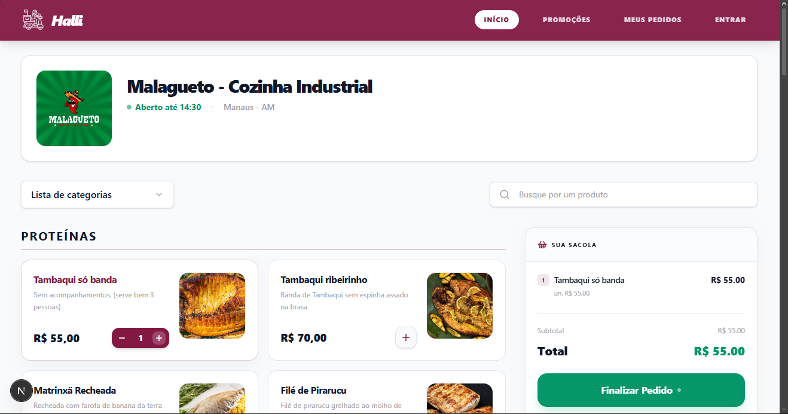
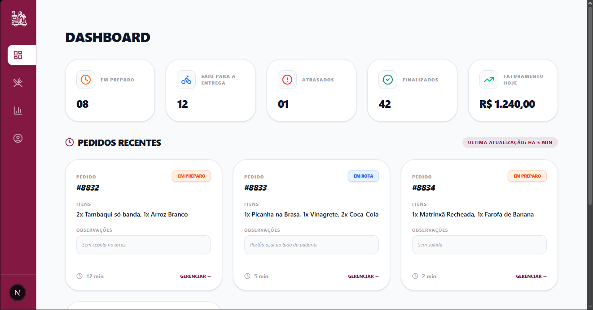

<!-- Banner -->

**Halli** é uma solução de **delivery SaaS** moderna, desenvolvida para proporcionar uma experiência otimizada tanto para o cliente final quanto para a gestão do estabelecimento.

**Acesse aqui:** [Halli Online](https://halli-app.vercel.app/)

---

## Badges

---

## Features

* 
**Autenticação de Usuário**: login seguro via e-mail/senha e provedores sociais com Firebase Auth.

* 
**Interface de Consumo**: experiência otimizada com filtragem dinâmica por categorias e busca em tempo real.

* 
**Sacola Reativa**: gestão de estado global para o carrinho de compras utilizando Zustand.

* 
**Painel Administrativo**: dashboard completo de KPIs e navegação lateral para gestão total do restaurante.

* 
**Gestão de Cardápio**: CRUD completo de produtos, controle de estoque e categorias em tempo real.

* 
**Financeiro & Relatórios**: geração de resumos financeiros diários, semanais e mensais.

* 
**Logística Inteligente**: algoritmos de priorização de entregas por geofencing e distância.

* 
**Design Responsivo**: interface mobile-first totalmente adaptável para qualquer dispositivo (360px a 4K).

---

## Technologies Used

* 
**Next.js 15+** (App Router) 

* 
**React & TypeScript** 

* 
**Tailwind CSS** (estilização baseada em Design Tokens) 

* 
**Zustand** (gerenciamento de estado global) 

* 
**Firebase** (Firestore Database & Authentication) 

* 
**Vercel** (Hosting & CI/CD) 

---

## Preview

<h3>Interface do Cliente</h3>

<h3>Painel Administrativo</h3>

---

## Project Status

**Em desenvolvimento** – ajustes de frontend em andamento.

**Em desenvolvimento** – implementação do metodo de pagamento online.

**Em seguida** – implementação do back-end e banco de dados.

**Futuramente** – novas funcionalidades de integração de pagamentos e notificações via WhatsApp estão planejadas.

---

## Author

Made by **[Levy Abreu](https://github.com/LevyAbreu)**

